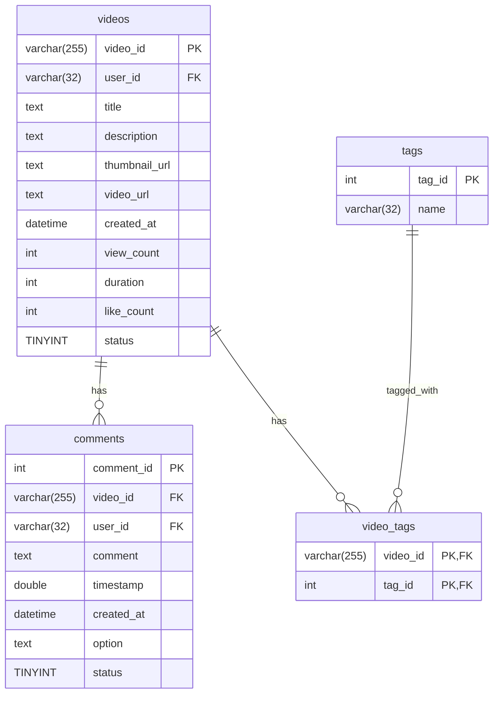

# DB schema

```mermaid
erDiagram  
  videos {
	varchar(255) video_id PK
	varchar(32) user_id FK
	text title
	text description
	text thumbnail_url
	text video_url
	datetime created_at
	int view_count
	int duration
	int like_count
	TINYINT status
  }
  comments {
	int comment_id PK
	varchar(255) video_id FK
	varchar(32) user_id FK
	text comment
	double timestamp
	datetime created_at
	text option
	TINYINT status
  }
  
  tags {
	int tag_id PK
	varchar(32) name
  }

  video_tags {
	varchar(255) video_id PK,FK
	int tag_id PK,FK
  }
  
  videos||--o{comments : has
  videos||--o{video_tags : has
  tags||--o{video_tags : tagged_with
```

