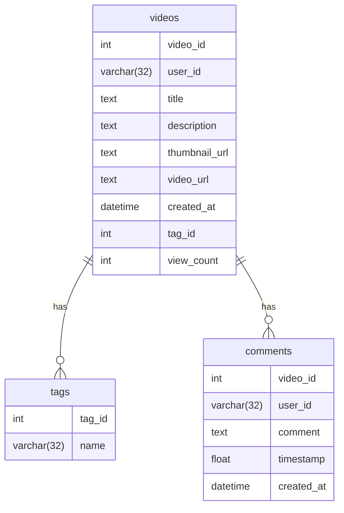

# DB schema

```mermaid
erDiagram  
  videos {
	int video_id
	varchar(32) user_id
	text title
	text description
	text thumbnail_url
	text video_url
	datetime created_at
	int tag_id
	int view_count
  }
  comments {
	int video_id
	varchar(32) user_id
	text comment
	float timestamp
	datetime created_at
  }
  
  tags {
	int tag_id
	varchar(32) name
  }
  
  videos||--o{tags : has
  videos||--o{comments : has
```

